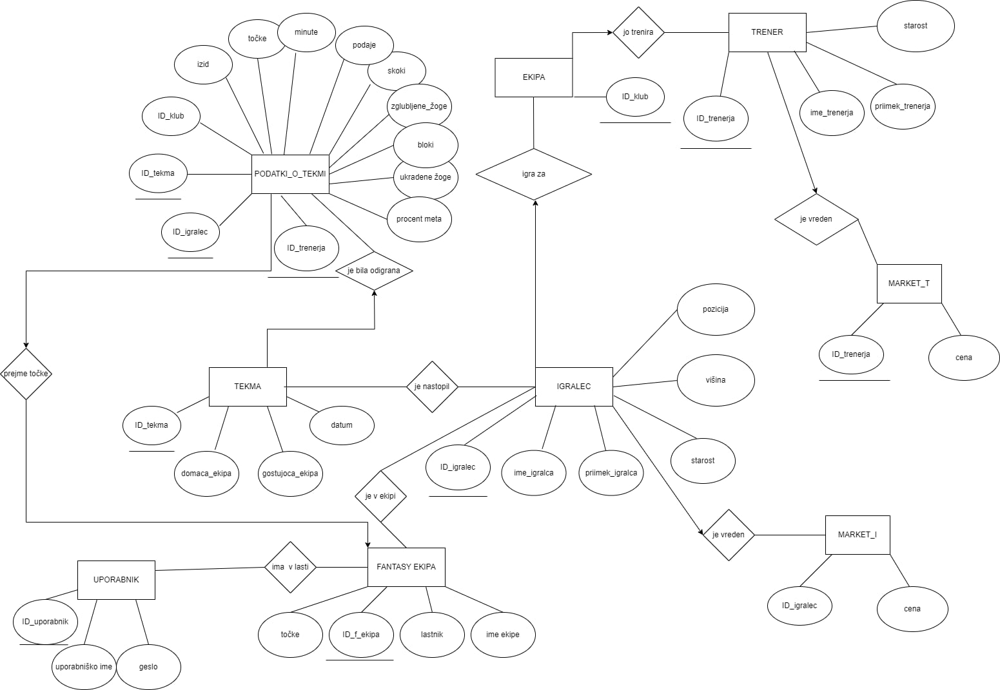

# NBA-fantasy-app
Projektna naloga pri predmetu Osnove podatkovnih baz.

## Opis

Aplikacija je namenjena igranju NBA fantasy league-a. Uporabnik se ob prvi uporabi registrira, izbere ekipo igralcev, ki mu na podlagi resnične statistike odigranih tekem v NBA prinašajo točke. Cilj vsakega uporabnika je, da ob omejenih začetnih sredstvih izbere ekipo, ki mu bo prinesla čim več točk. 

Statistične podatke o tekmah in igralcih bova pridobila s spletne strani [basketball-reference.com](basketball-reference.com).

### ER diagram

